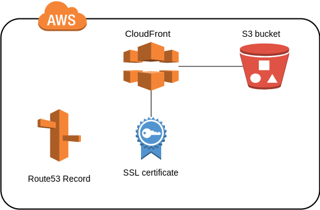

# AWS Terraform Cloudfront distribution S3 backend

Terraform module which creates AWS CloudFront Distribution with the S3 as a backend.

## Requirements

| Name | Version |
|------|---------|
|  [terraform](#requirement\_terraform) | >= 0.15.0 |
|  [aws](#requirement\_aws) | >= 3.40.0 |

## Providers

| Name | Version |
|------|---------|
|  [aws](#provider\_aws) | >= 3.40.0 |
|  [aws.virginia](#provider\_aws.virginia) | >= 3.40.0 |

## Modules

No modules.

## Resources

| Name | Type |
|------|------|
| [aws_acm_certificate.certificate](https://registry.terraform.io/providers/hashicorp/aws/latest/docs/resources/acm_certificate) | resource |
| [aws_acm_certificate_validation.validation](https://registry.terraform.io/providers/hashicorp/aws/latest/docs/resources/acm_certificate_validation) | resource |
| [aws_cloudfront_distribution.website](https://registry.terraform.io/providers/hashicorp/aws/latest/docs/resources/cloudfront_distribution) | resource |
| [aws_cloudfront_origin_access_identity.cf-identity](https://registry.terraform.io/providers/hashicorp/aws/latest/docs/resources/cloudfront_origin_access_identity) | resource |
| [aws_route53_record.alias](https://registry.terraform.io/providers/hashicorp/aws/latest/docs/resources/route53_record) | resource |
| [aws_route53_record.validation](https://registry.terraform.io/providers/hashicorp/aws/latest/docs/resources/route53_record) | resource |
| [aws_s3_bucket.bucket](https://registry.terraform.io/providers/hashicorp/aws/latest/docs/resources/s3_bucket) | resource |
| [aws_s3_bucket_object.website](https://registry.terraform.io/providers/hashicorp/aws/latest/docs/resources/s3_bucket_object) | resource |
| [aws_s3_bucket_policy.s3_policy_attach](https://registry.terraform.io/providers/hashicorp/aws/latest/docs/resources/s3_bucket_policy) | resource |
| [aws_s3_bucket_public_access_block.bucket_block_public](https://registry.terraform.io/providers/hashicorp/aws/latest/docs/resources/s3_bucket_public_access_block) | resource |
| [aws_iam_policy_document.s3_policy](https://registry.terraform.io/providers/hashicorp/aws/latest/docs/data-sources/iam_policy_document) | data source |
| [aws_route53_zone.zone](https://registry.terraform.io/providers/hashicorp/aws/latest/docs/data-sources/route53_zone) | data source |

## Inputs

| Name | Description | Type | Default | Required |
|------|-------------|------|---------|:--------:|
|  [cf\_cache\_allowed](#input\_cf\_cache\_allowed) | Allowed methods | `list(string)` | <pre>[   "GET",   "HEAD",   "OPTIONS" ]</pre> | no |
|  [cf\_cached\_methods](#input\_cf\_cached\_methods) | Methods for caching | `list(string)` | <pre>[   "GET",   "HEAD" ]</pre> | no |
|  [cf\_compress](#input\_cf\_compress) | Do you want to enable compression | `bool` | `true` | no |
|  [cf\_default\_ttl](#input\_cf\_default\_ttl) | Default ttl for caching | `number` | `3600` | no |
|  [cf\_enabled](#input\_cf\_enabled) | Whether if cf is enabled | `bool` | `true` | no |
|  [cf\_geo\_restrictions](#input\_cf\_geo\_restrictions) | Map for restriction | `any` | `{}` | no |
|  [cf\_http\_version](#input\_cf\_http\_version) | HTTP version for cf | `string` | `"http2"` | no |
|  [cf\_include\_cookies](#input\_cf\_include\_cookies) | Enabled cookies in logging | `bool` | `false` | no |
|  [cf\_is\_ipv6\_enabled](#input\_cf\_is\_ipv6\_enabled) | Whether if ipv6 is enabled | `bool` | `true` | no |
|  [cf\_logging\_bucket](#input\_cf\_logging\_bucket) | Name of bucket with domain for logs (don't forget domain) | `string` | n/a | yes |
|  [cf\_logging\_prefix](#input\_cf\_logging\_prefix) | Prefix for storing logs | `string` | `""` | no |
|  [cf\_max\_ttl](#input\_cf\_max\_ttl) | Max ttl for caching | `number` | `86400` | no |
|  [cf\_min\_ttl](#input\_cf\_min\_ttl) | Min ttl for caching | `number` | `0` | no |
|  [cf\_minimum\_protocol\_version](#input\_cf\_minimum\_protocol\_version) | Minimum protocol version for SSL | `string` | `"TLSv1.2_2019"` | no |
|  [cf\_origin\_access\_identity\_comment](#input\_cf\_origin\_access\_identity\_comment) | Comment for CloudFront Identity | `string` | `""` | no |
|  [cf\_ssl\_support\_method](#input\_cf\_ssl\_support\_method) | SSL support method for CloudFront | `string` | `"sni-only"` | no |
|  [cf\_viewer\_protocol\_policy](#input\_cf\_viewer\_protocol\_policy) | CloudFront viewer protocol policy | `string` | `"redirect-to-https"` | no |
|  [domain\_name](#input\_domain\_name) | The domain name for the website. | `string` | n/a | yes |
|  [hostname](#input\_hostname) | hostname for website without domain | `string` | n/a | yes |
|  [module\_depends\_on](#input\_module\_depends\_on) | List of resources which module depends on | `list(string)` | `[]` | no |
|  [module\_enabled](#input\_module\_enabled) | Whether to create resources within the module or not. Default is true. | `bool` | `true` | no |
|  [s3\_acl](#input\_s3\_acl) | ACL for bucket. Possible values: private, public-read, public-read-write, aws-exec-read, authenticated-read, and log-delivery-write | `string` | `"public-read"` | no |
|  [s3\_index\_document](#input\_s3\_index\_document) | File in bucket which should be index page | `string` | `"index.html"` | no |
|  [s3\_upload\_files\_path](#input\_s3\_upload\_files\_path) | Path to the folder with files for uploading to the s3 bucket | `string` | n/a | yes |
|  [s3\_versioning](#input\_s3\_versioning) | Whether to enable versioning on S3 or not. Default is true | `bool` | `true` | no |

## Outputs

| Name | Description |
|------|-------------|
|  [bucket\_acl](#output\_bucket\_acl) | ACL of the backend S3 bucket |
|  [bucket\_arn](#output\_bucket\_arn) | ARN of the backend S3 bucket |
|  [bucket\_domain\_name](#output\_bucket\_domain\_name) | Domain name of the backend S3 bucket |
|  [bucket\_name](#output\_bucket\_name) | Name of the backend S3 bucket |
